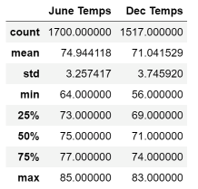

# surfs_up

# Overview

This research examines how Data Storage and retrieval may be used to efficiently construct a temperature trend analysis in Oahu, Hawaii. Summary statistics of temperature data were specifically required for the months of June and December.

# Resources

  - Software: SQLlite, Python, Flask, Jupyter Notebook
  - Data Tools: Python SQL toolkit (SQLAlchemy), pandas, numpy
  - Data Source: hawaii.sqlite

# Analysis

## Deliverable 1

### Determine the Summary Statistics for June

Filtering the date column of the Measurements table in the hawaii.sqlite database to retrieve all the temperatures for the month of June. And then convert those temperatures to a list, creating a DataFrame from the it and generating the summary statistics.
 
## Deliverable 2

### Determine the Summary Statistics for December

Filtering the date column of the Measurements table in the hawaii.sqlite database to retrieve all the temperatures for the month of December. And then convert those temperatures to a list, creating a DataFrame from the it and generating the summary statistics.

# Results

  - The maximum temperature difference is 2°F, with June reaching 85°F and December at 83°F.
  - The mean temperature difference is 4°F, with June at 75°F and December at 71°F.
  - The minimum temperature difference is 8°F, with June at 64°F and December at 56°F.

# Summary

When compared to other states in the US, the temperature variation between June and December isn't as large. This explains why Hawaii is a popular tourist and surfing destination.

